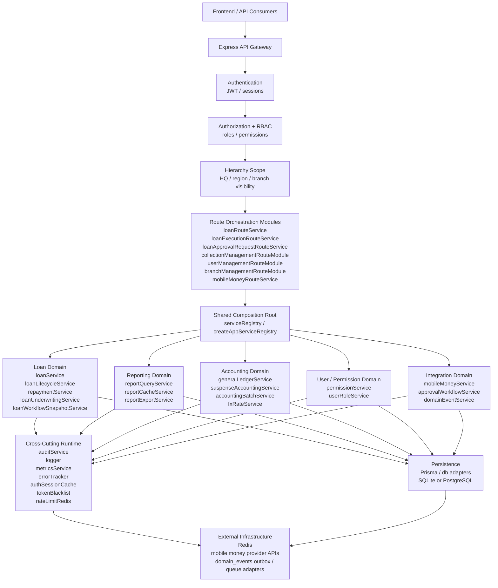

# System Relationship Overview

This document is the shortest path to understanding how the major backend sections depend on each other today.

Use it as the entry point, then follow the linked deep-dive documents for route catalogs, service-level dependencies, and transition plans.

Related documents:
- `docs/architecture/service-directory-dependencies.md`
- `docs/architecture/api-route-structure.md`
- `docs/architecture/event-driven-cqrs-multitenant-plan.md`

## 1. Canonical Runtime Map



## 2. How Sections Relate

| Section | Depends On | Why It Matters |
|---------|------------|----------------|
| Authentication | API gateway, token/session stores | Identity must exist before any domain workflow can run. |
| Authorization | Authentication, role/permission services | Route entry and sensitive actions depend on both identity and permission resolution. |
| Hierarchy scope | Authorization, hierarchy service | Access is limited not just by role, but by branch/region/HQ visibility. |
| Route modules | Auth, RBAC, scope, service registry | Routes should remain orchestration-only and defer business decisions to shared services. |
| Loan domain | Hierarchy scope, underwriting, approval, accounting, audit, cache invalidation | Loan operations are the central source of downstream side effects. |
| Approval workflow | Loan lifecycle, maker-checker rules, audit | Approval requests do not replace loan lifecycle logic; they govern high-risk mutations. |
| Repayment and mobile money | Loan lifecycle, accounting, audit | Provider callbacks and manual repayments must converge on the same balance and ledger outcomes. |
| Reporting | Hierarchy scope, cache, database reads, mutation invalidation | Report correctness depends on scope filters and cache invalidation from operational writes. |
| Accounting | Loan and repayment mutations, FX, batch services | Financial side effects are coupled to lifecycle events even when hidden behind service boundaries. |
| Infrastructure | Redis, DB, external providers, outbox | Runtime reliability depends on these shared dependencies across multiple domains. |

## 3. Critical Relationship Rules

1. Identity is not authorization.
   Authentication establishes who the caller is. Authorization and hierarchy scope decide what they may do and where they may do it.

2. Route handlers are not the business layer.
   Route modules handle HTTP, validation, and composition. Domain rules belong in services created by the shared registry.

3. Scope enforcement is intentionally layered.
   The codebase checks scope at route boundaries and again inside reporting or domain services, which reduces trust in any single gateway check.

4. Loan workflows are the main dependency hub.
   Loan origination, approval, disbursement, repayment, collections visibility, reporting freshness, and accounting movement all intersect here.

5. Approval requests are not the normal approval path.
   Standard origination approval is a direct loan action. `approval_requests` are mainly the review-and-execution envelope for higher-risk lifecycle mutations.

6. Cache correctness depends on write paths.
   Reporting can only stay correct when loan, client, branch, and collection mutations invalidate stale cached views.

7. Mobile money is part of core business flow, not a side adapter.
   Wallet disbursement and C2B reconciliation feed the same repayment and lifecycle services used by manual operations.

## 4. Two Approval Paths

### 4.1 Standard Loan Origination Approval

```text
POST /api/loans
  -> loanService checks readiness, scope, product, underwriting
  -> loan created in pending_approval

POST /api/loans/:id/approve
  -> loanLifecycleService applies maker-checker and approval invariants
  -> loan moves to approved

POST /api/loans/:id/disburse
  -> loanLifecycleService or mobileMoneyService funds the loan
  -> accounting, audit, cache invalidation, and domain events follow
```

### 4.2 High-Risk Lifecycle Mutation Approval

```text
POST /api/loans/:id/restructure | /write-off | /top-up | /refinance | /extend-term
  -> loanLifecycleService validates state and scope
  -> approvalWorkflowService creates pending approval_request

POST /api/approval-requests/:id/approve or reject
  -> checker rules and maker-checker constraints enforced
  -> reject closes the request only
  -> approve executes the underlying mutation in a transaction
  -> approval_requests.executed_at is stamped only after successful execution
```

## 5. Most Important Cross-Section Dependencies

### 5.1 Loans -> Accounting

Disbursement, repayment, write-off, and other lifecycle changes have direct accounting implications. Treat ledger posting as part of the workflow, not as optional after-the-fact bookkeeping.

### 5.2 Loans -> Reporting

Portfolio, arrears, collections, officer performance, and board-summary reports all depend on loan state, repayment state, and branch visibility. Reporting quality therefore depends on correct invalidation after operational mutations.

### 5.3 Users / Permissions -> Everything

Role and permission resolution is upstream of every sensitive route. When permissions drift, multiple modules break at once because the same caller context feeds users, branches, loans, approvals, and reports.

### 5.4 Hierarchy -> Everything With Branch Data

Hierarchy scope is a shared dependency across loans, collections, branch reporting, user administration, and most reporting paths. A hierarchy bug is rarely isolated.

### 5.5 Mobile Money -> Repayment / Disbursement / Reconciliation

Provider integrations should continue to reuse the same loan and repayment services so idempotency, ledger movement, and workflow state remain aligned.

### 5.6 Accounting Batches -> Interest / Penalty State

End-of-day financial processing is split across dedicated engines. `interestAccrualEngine` applies idempotent daily accruals for `daily_eod` interest profiles, while `penaltyEngine` charges overdue installments using grace days, base selection, compounding rules, and caps. These flows share accounting infrastructure but do not mutate exactly the same records.

### 5.7 Hierarchy Scope -> SQL and Cache Keys

Hierarchy scope is resolved into active branch visibility first, then translated into SQL conditions and cache-key context. The stable dependency is the resolved branch set, not a simplistic assumption that every non-HQ role maps to one fixed region predicate.

## 6. Reading Order

1. Read this file for the system-level map.
2. Read `docs/architecture/service-directory-dependencies.md` for service-to-service dependencies.
3. Read `docs/architecture/api-route-structure.md` for the canonical HTTP surface.
4. Read `docs/architecture/event-driven-cqrs-multitenant-plan.md` for data-flow detail and future-state transition work.